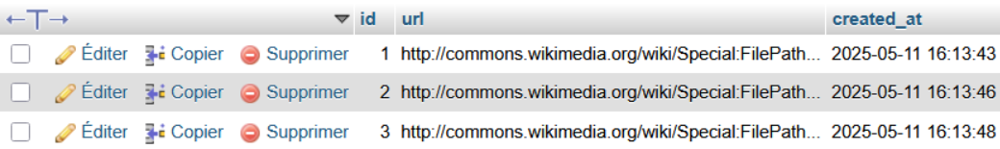
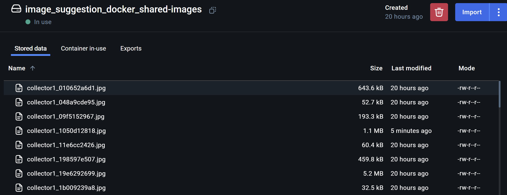
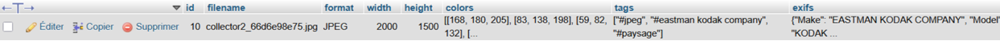
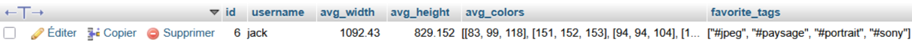

# Projet de Traitement de Données Massives - Système de Recommandation d'Images

## Objectif

Ce projet implémente un système de recommandation d'images basé sur les préférences des utilisateurs, utilisant Docker pour modulariser les différentes tâches et Apache Spark (PySpark) pour le traitement distribué des données.

## Architecture du Système

Le système est composé de 10 microservices conteneurisés, chacun responsable d'une tâche spécifique :

### Composants Principaux

1. **Manager** - Orchestrateur principal et API gateway
2. **Data Collectors (x2)** - Acquisition d'images depuis Wikidata  
3. **Data Analyzer** - Extraction de métadonnées et analyse d'images
4. **User Profiler** - Création et mise à jour des profils utilisateurs
5. **Image Recommender** - Système de recommandation basé sur MapReduce
6. **Nginx** - Serveur proxy et équilibreur de charge et héberge le Frontend (Interface utilisateur Svelte)
7. **MariaDB** - Base de données relationnelle
8. **PhpMyAdmin** - Interface de la BDD
9. **Redis** - Cache et messagerie temps réel

### Diagramme d'Architecture


## Flux de Communication

Le système utilise plusieurs mécanismes de communication :

- **REST API** pour la communication entre services
- **Redis PubSub** pour la messagerie asynchrone
- **Volumes Docker** pour le partage de fichiers
- **Base de données partagée** pour la persistance

### Diagramme de Flux du téléchargement d'image


### Diagramme de Flux des interactions utilisateur


## Diagramme de Séquence


## Technologies Utilisées

- **Docker & Docker Compose** - Conteneurisation
- **PySpark** - Traitement distribué des données
- **Python Flask** - API REST
- **MariaDB** - Base de données relationnelle
- **PhpMyAdmin** - Interface de la BDD
- **Redis** - Cache et messagerie
- **Svelte** - Frontend réactif
- **Nginx** - Reverse proxy
- **SPARQL** - Requêtes Wikidata

## Tâches Indépendantes Identifiées

### 1. Acquisition de Données (Data Collectors)
- **Fonctionnalité** : Télécharge automatiquement des images depuis Wikidata
- **Parallélisation** : Deux collecteurs travaillent en parallèle

Les images sont référencées uniquement par leur nom dans la base de données, tandis que les fichiers images eux-mêmes sont stockés dans le volume partagé Docker, permettant ainsi leur accès par tous les services concernés
#### Image dans la base de données:


#### Image dans le volume :


### 2. Analyse de Données (Data Analyzer)
- **Fonctionnalité** : Extraction de métadonnées (couleurs, dimensions, EXIF)

Une fois les images téléchargées, elles sont automatiquement analysées par le service Data Analyzer, et les métadonnées extraites (couleurs dominantes, dimensions, tags) sont ensuite stockées dans la base de données MariaDB
#### Stockage Métadonnées :


### 3. Profilage Utilisateur (User Profiler)
- **Fonctionnalité** : Création et fusion des profils basés sur les préférences

Lorsque l'utilisateur termine le calibrage de son profil, le système génère et stocke une empreinte de ses préférences visuelles sous forme de données structurées comprenant la moyenne des dimensions (hauteur et largeur) des images appréciées, leurs couleurs dominantes agrégées, ainsi que les tags les plus fréquemment associés à ses choix.

#### Sotckage profil utilisateur :


### 4. Recommandation (Image Recommender)
- **Fonctionnalité** : Génération de recommandations personnalisées
- **Lambda Expressions** : Calcul des moyennes et tags favoris
- **PySpark MapReduce** : Calcul de similarité sur l'ensemble du dataset avec le profil utilisateur
- **Optimisation** : System de stockage Redis pour les réponses rapides

## Démarrage du Projet

Le projet démarre automatiquement ses processus principaux :

1. **Téléchargement Automatique des Images**
   - Se lance immédiatement au démarrage
   - Télécharge 5 images toutes les 10 secondes
   - Collecte 150 images au total (50 villes, 50 nébuleuses, 50 montagnes)
   - Aucune intervention manuelle requise

2. **Services Indépendants**
   - Le téléchargement des images
   - La navigation sur le site
   - Le système de recommandation
   
   Ces trois composants fonctionnent de manière totalement autonome.

### Dataset
- **Total** : 150 images
- **Catégories** : 
  - 50 images de villes
  - 50 images de nébuleuses  
  - 50 images de montagnes
- **Page dédiée** : `/dataset` sur le site web pour visualiser toutes les images

## Volumes Docker

Le système utilise des volumes pour le partage de données :

```yaml
volumes:
  db_data:
  shared-images:
```

- **shared-images** : Partagé entre tous les services pour l'accès aux images
- **db_data** : Persistance des données MariaDB

## Lancement du Projet

```bash
# Cloner le repository
git clone https://github.com/Robin43667/image_suggestion_docker.git

# Naviguer dans le dossier
cd image-recommendation-system

# Lancer le système complet
docker-compose up

# Le système démarre automatiquement :
# - Le téléchargement des images commence immédiatement
# - L'interface web est accessible sur http://localhost
# - Aucune intervention manuelle nécessaire 
```

## Sécurité et Performance

- **Authentification** : Système de cookies sécurisés
- **Cache Redis** : Recommandations mises en cache (TTL: 15 minutes)
- **Load Balancing** : Nginx répartit la charge entre services de collecte
- **Optimisation** : Images redimensionnées automatiquement (512x512)

## Interface Utilisateur

- **Page d'accueil** : Connexion/inscription
- **Dashboard** : Processus de calibration
- **Recommandations** : Interface like/skip intuitive
- **Dataset** : Page dédiée pour visualiser toutes les images

## Monitoring et Logs

- Logs structurés pour chaque service
- Redis PubSub pour les événements temps réel
 
## Points Forts

1. **Architecture Microservices** : Séparation claire des responsabilités
2. **Traitement Distribué** : PySpark pour les calculs intensifs
3. **Automatisation Complète** : Démarrage autonome du système
4. **Scalabilité** : Design modulaire permettant l'extension facile
5. **Performance** : Cache Redis et optimisation des images
6. **Indépendance des Processus** : Services découplés pour une maintenance facile

## Contributeurs

- Robin RIBAUDEAU
- Thibaut CIZERON